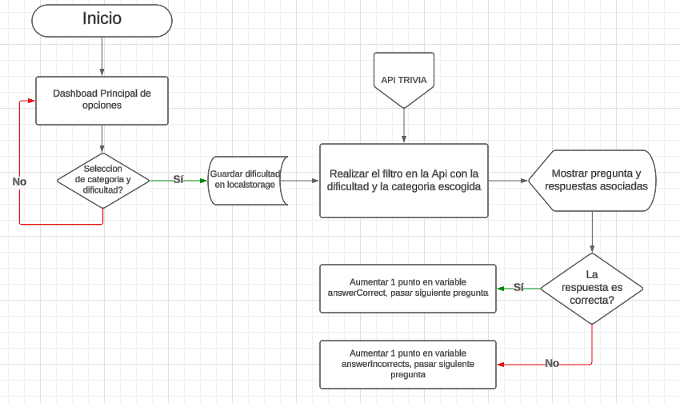
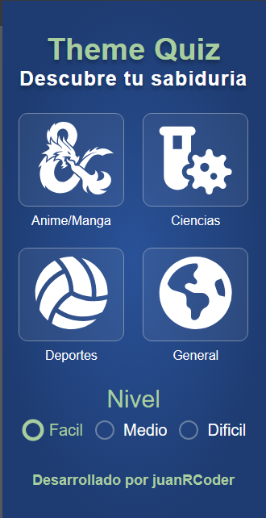
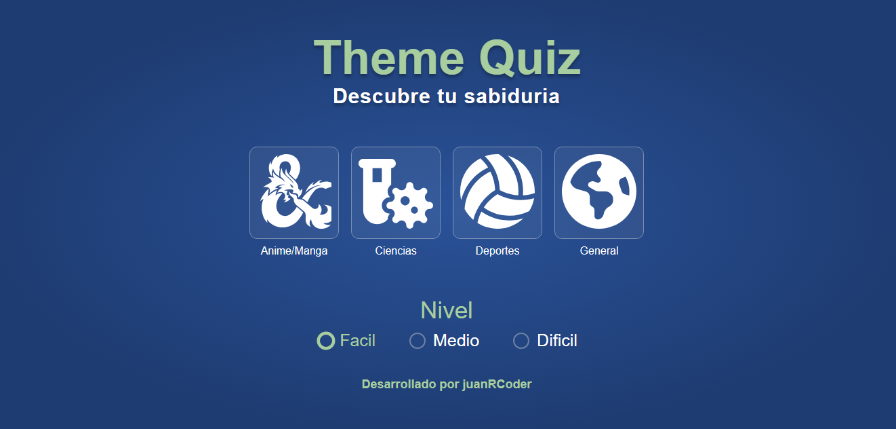

## Theme-Quizz: Pon a prueba tu sabiduria

Pon a prueba tu sabiduria, esta aplicacion tiene una serie de preguntas separadas por dificultad y 4 categorias("en un futuro pondre mas categorias"), adivina la respuesta 
correcta y aprender algo nuevo al dia, resolviendo esta pequeña quizz.

WebSite: [https://theme-quiz.netlify.app/](https://theme-quiz.netlify.app/)

## 🛠 Tecnologías:

- Este proyecto fue realizado con las siguientes tecnologias y dependencias:
  - 
  - 
  - 
  - 

## 📈 Diagrama de flujo:

- Este es un pequeño diagrama del planteamiento y seguimiento estatico del proyecto.

  

## 📱💻 Diseño responsivo (mobile & tablet):

- Estos son los diferentes vistas para cualquier dispositivo.

   
   

## API TRIVIA (categoria anime):
- https://opentdb.com/api.php?amount=21&category=31&difficulty=easy

## 🧑 Autor: Juan Ramirez

- Linkedin: [@Juan Ramirez](https://www.linkedin.com/in/juan-ramirez-490b84271/)
- Instagram: [@juanrcoder](https://www.instagram.com/juanrcoder/)

### Proyecto:

- WebSite: [https://theme-quiz.netlify.app/](https://theme-quiz.netlify.app/)

## Licence:

- Este proyecto está bajo la Licencia MIT - ver el archivo [LICENSE](LICENSE) para más detalles.
